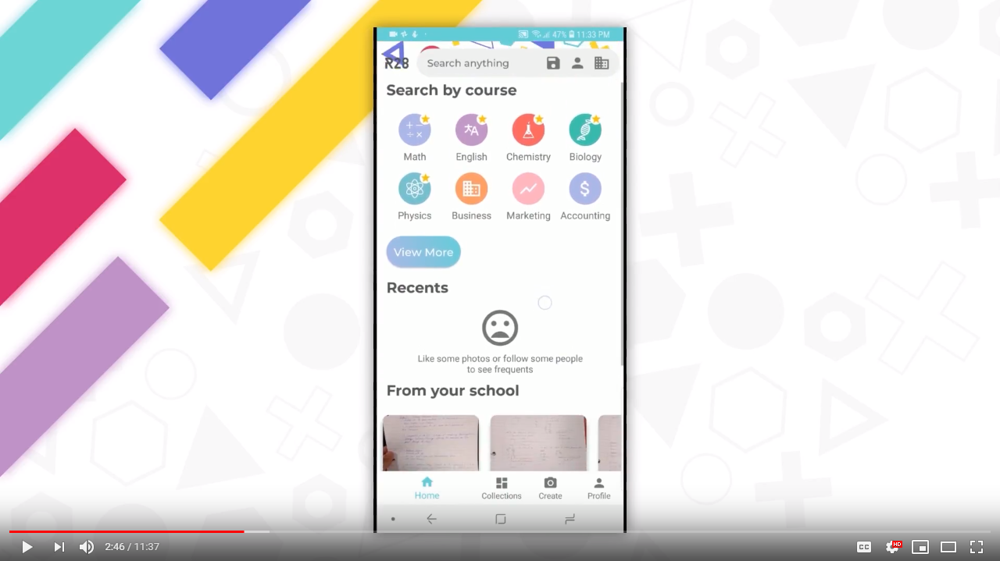
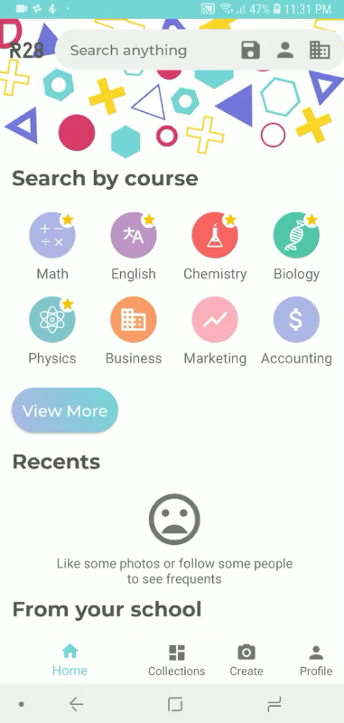
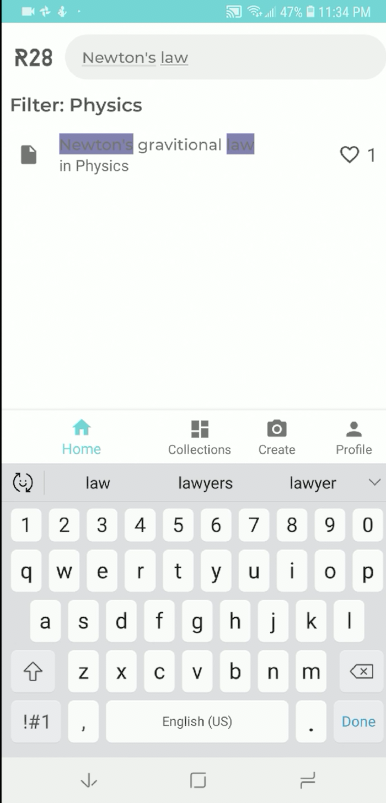
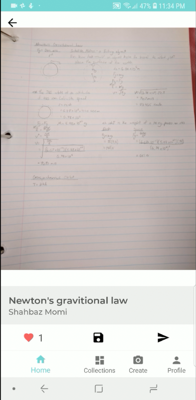
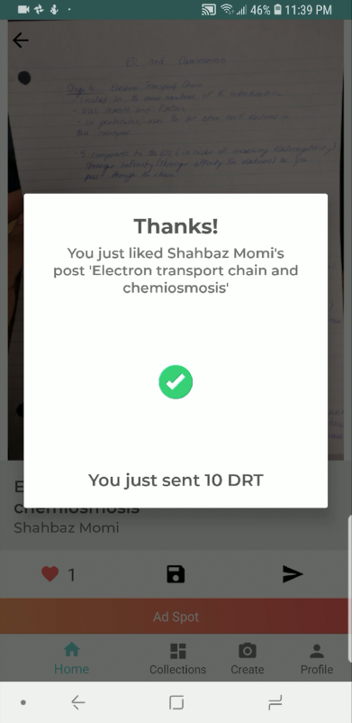
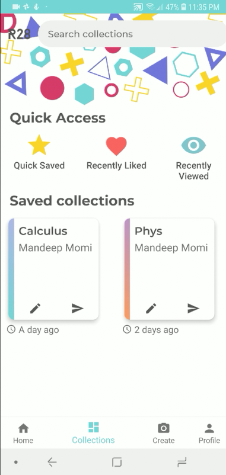
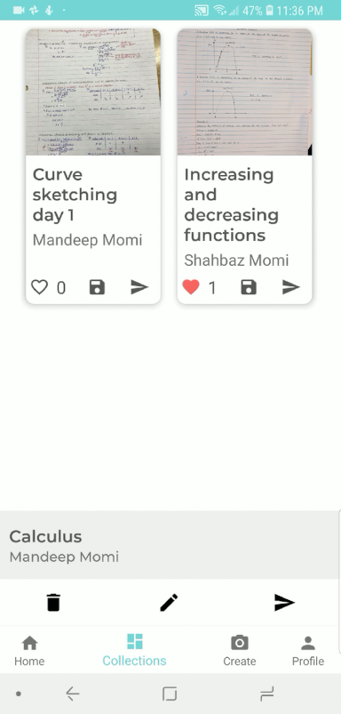
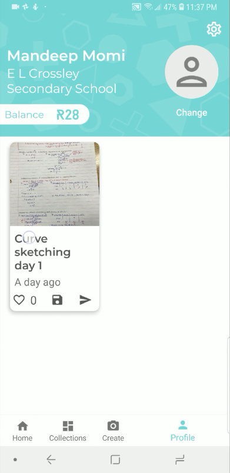
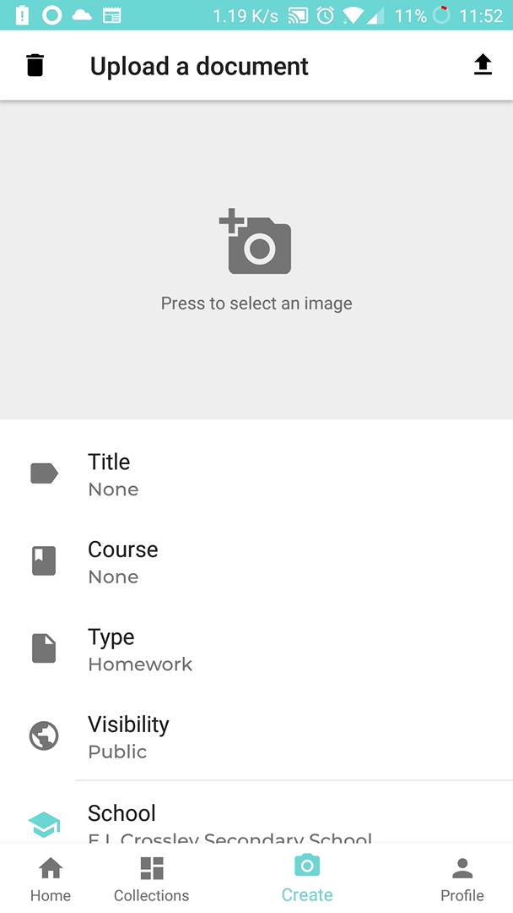

# Workway
### An app allowing users to share documents (homework, etc.) with each other and getting rewarding in the process

---

### What is this
Workway makes it easy to organize, share, and find homework among many other documents. Users can select and edit while automatically tagging documents to allow for quick and convenient organization, and then share them with the online community. When a post is liked, the user gets rewarded in the form of a cryptocurrency, which can then be cashed out later for actual money.

### Video
Check out this video detailing the project:

### Screenshots

 
The homepage of the app, where the two most important functions can be found; searching and filtering. Searching is **fully elastic**, and powered by Algolia Elastic Search.
 

 
The post page of the app, where the actual documents themselves can be viewed, with full gesture support (zooming, rotating, fullscreen). The second picture shows an example of user liking a post, effectively sending them cryptocurrency
 

 
The collections view of the app, where users can create collections and put relevant posts inside them as they choose. Second page shows the actual collection page UI.
 

 
The profile view of the app, which displays the users uploaded documents chronologically. The second image shows the upload document page, where users can select, edit, and tag documents.
 